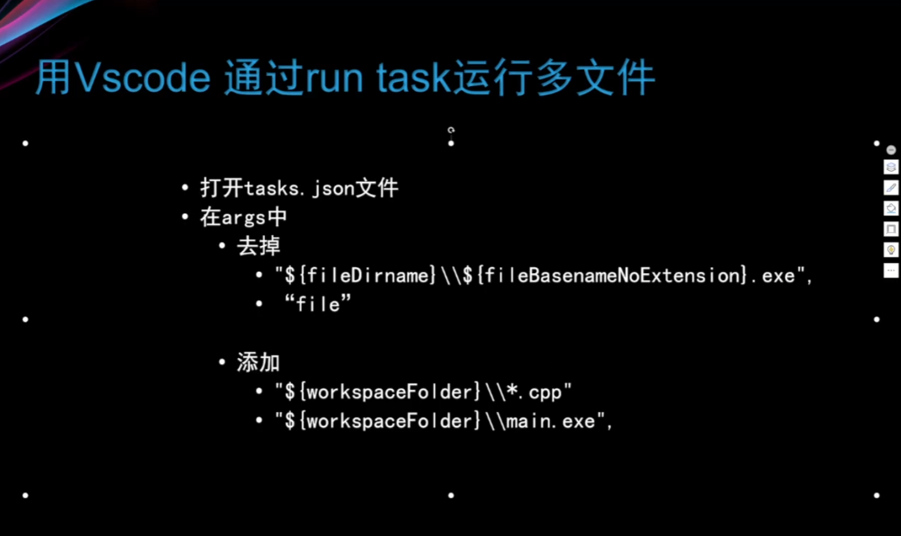

# 第一节 多文件命令进行编译
- 头文件引入#include "yourfile.h"
  - 一般再yourfile.h中生命，在yourfile.cpp中定义
- 编译命令
  - g++ -o main.exe main.cpp yourfile.cpp
  - 该命令分实际为两部
    - 1、生成给object文件
       -- g++ -c main.cpp yourfile.cpp
       -- 会生成 main.o文件以及yourfile.o文件
    - 2、生成二进制文件（link)
      - g++ -o main.exe main.o yourfile.o
      - 生成main.exe二进制文件
- 避免多次引用相同的内容
  - 方法一： #ifndef YOURFILE_H
            #define YOURFILE_H
            代码
            #endif
  - 方法二：#parama once 
# 第二节 配置vscode支持多文件编译
